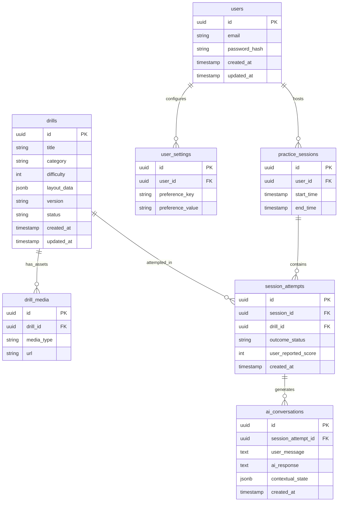
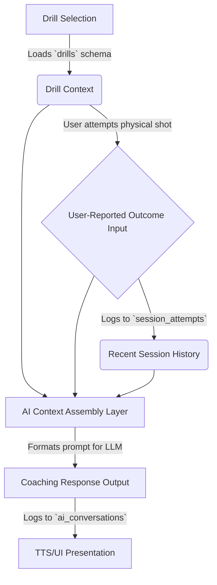

# Initial Data Model and Database Design

**Status:** Draft / Baseline
**Date:** 2026-03-31

## 1. Purpose

This document outlines the first iteration of the relational data model for Version 1 of the platform. It defines the core entities, their primary relationships, and the boundaries between persisted database records and derived or transient session state. It serves as the direct blueprint for the eventual backend ORM implementation.

## 2. Entity Relationship Diagram (ERD)

## 3. Entity Definitions

### `users`
*   **Purpose**: Represents authenticated players engaging with the platform.
*   **Primary Key**: `id` (`uuid`).
*   **Important Foreign Keys**: None.
*   **Data Type**: Core persisted data.

### `user_settings`
*   **Purpose**: Stores key-value preferences for a user (e.g., TTS enabled, preferred table size). This entity is intentionally modeled flexibly as a generic Key-Value pair store for V1 to accommodate rapidly changing frontend configuration requirements.
*   **Primary Key**: `id` (`uuid`).
*   **Important Foreign Keys**: `user_id`.
*   **Data Type**: Core persisted data.

### `drills`
*   **Purpose**: The central catalog of playable content. Stores top-level stable relational metadata defined in the drill schema (e.g., `title`, `category`, `difficulty`) for fast querying and filtering. The complex physical drill layout payload, including coordinate arrays and instructions, is stored independently in a flexible `layout_data` JSONB field rather than being fully normalized.
*   **Primary Key**: `id` (`uuid`).
*   **Important Foreign Keys**: None (Author references omitted for early V1 simplicity).
*   **Data Type**: Core persisted data.

### `drill_media`
*   **Purpose**: Links supporting imagery or videos to a specific drill.
*   **Primary Key**: `id` (`uuid`).
*   **Important Foreign Keys**: `drill_id`.
*   **Data Type**: Supporting metadata.

### `practice_sessions`
*   **Purpose**: Groups a continuous block of training time for a given user.
*   **Primary Key**: `id` (`uuid`).
*   **Important Foreign Keys**: `user_id`.
*   **Data Type**: Core persisted data.

### `session_attempts`
*   **Purpose**: Represents a single physical attempt at a drill. Stores the user-reported outcome (e.g., "Pass", "Fail", or a numeric score).
*   **Primary Key**: `id` (`uuid`).
*   **Important Foreign Keys**: `session_id`, `drill_id`.
*   **Data Type**: Core persisted data.

### `ai_conversations`
*   **Purpose**: Logs the turn-based chat history between the user and the coaching assistant following a drill attempt. For early V1, this functions as a flat, per-exchange log model to capture rapid iterations. Future normalization of multi-turn message threads is deferred.
*   **Primary Key**: `id` (`uuid`).
*   **Important Foreign Keys**: `session_attempt_id`.
*   **Data Type**: Core persisted history data.

## 4. Data Ownership Boundaries

*   **Database (Persisted)**: User profiles, the drill library, session histories, formal outcomes, and AI chat logs.
*   **Derived/Transient State (In-Memory)**: Active projector window coordinates, real-time keystone warp matrices, partial STT transcriptions before final submission, and the immediate GUI rendering loop. If the application crashes, transient layout state is lost, but the `practice_sessions` data remains intact.
*   **Deferred Context**: Version 1 explicitly does not persist any high-frequency machine-vision state, camera video logs, or raw physical ball-tracking vectors.

## 5. AI Context Flow

This diagram illustrates how data flows from the static definition to a transient session, culminating in an AI coaching response.

## 6. Implementation Implications

*   **Prisma ORM**: This document serves as the direct blueprint for the `schema.prisma` file that will be defined in the backend service. Creating this schema will trigger the generation of TypeScript types across the repo.
*   **Unit Testability**: The clear boundary between persisted data (Database) and transient context (`AI Context Assembly Layer`) allows developers to write pure functions that take a mock `Drill`, mock `SessionHistory`, and mock `Outcome` to verify the generated prompt completely isolated from the database and the third-party LLM provider.
*   **Fast Iteration**: By storing `layout_data` and `contextual_state` as `jsonb` columns, early V1 iterations can aggressively modify rendering logic and AI prompt structures without requiring constant SQL database migrations.
