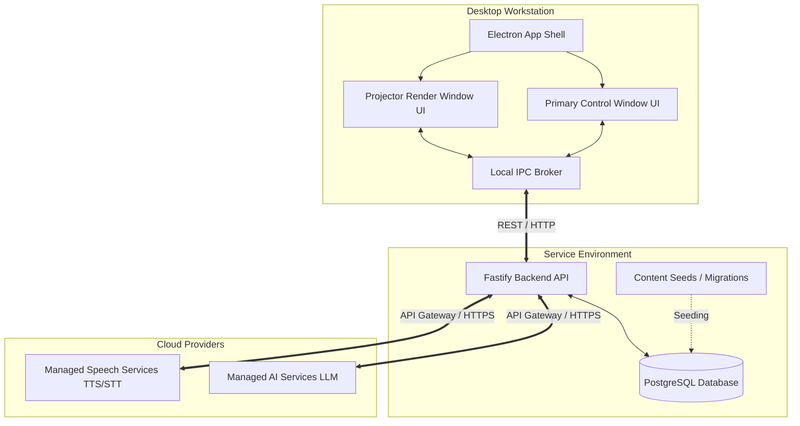
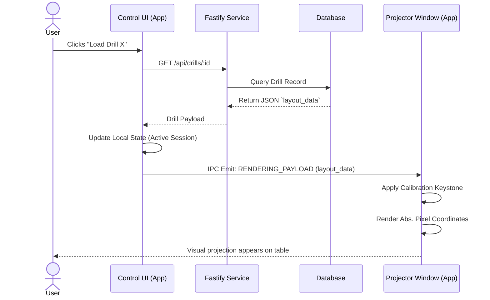
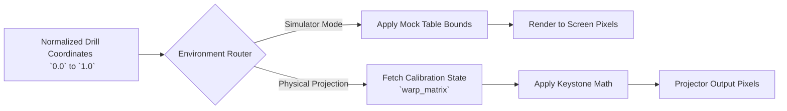
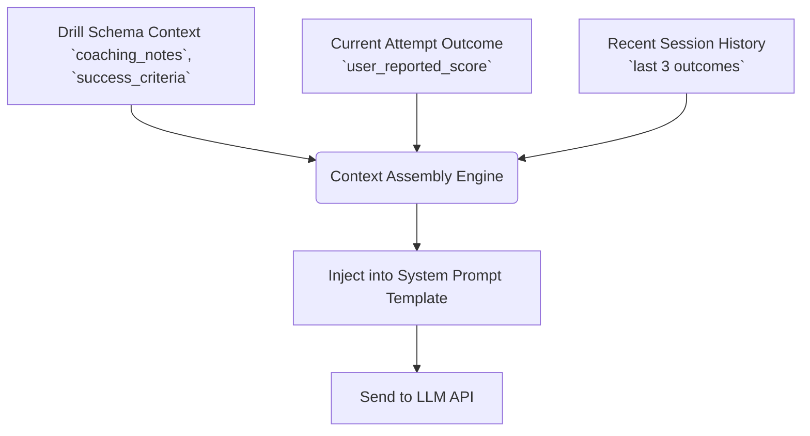
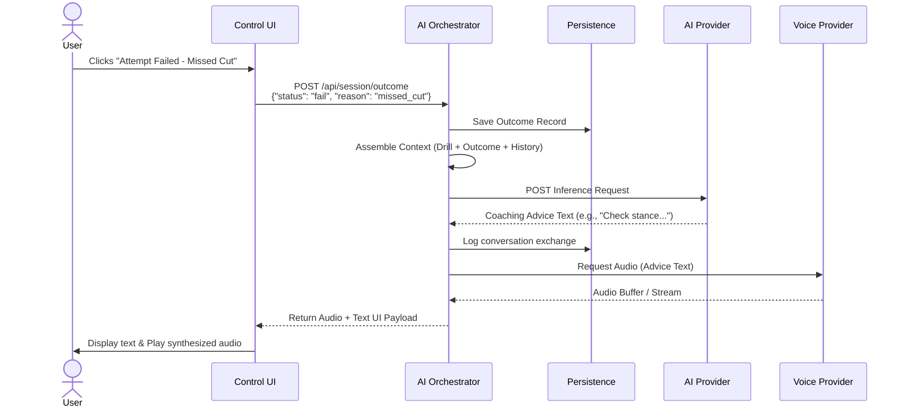

# System Interaction Diagrams

**Status:** Draft / Baseline
**Date:** 2026-03-31

## 1. Purpose

This document provides visual mapping for the primary data and control flows within Version 1 of the platform. These interaction diagrams serve as the architectural contract between the Electron desktop shell, the Fastify backend service, and external AI providers.

## 2. Overall System Architecture

This high-level architecture maps the physical deployment boundaries.

## 3. Drill Selection to Rendering Flow

This sequence diagrams the process from a user selecting a drill to the graphics appearing on the physical table (or simulator screen).

## 4. Projector/Simulator Rendering Flow

This flowchart details how the standardized `(0.0 - 1.0)` drill layout is mathematically transformed into physical pixels. *Note: this pure-function mathematical pipeline must be exhaustively unit tested during implementation.*

## 5. AI Context Assembly Flow

When a user finishes a recorded attempt, the system must synthesize static instruction, past history, and the new outcome into a single, cohesive LLM prompt.

## 6. User Outcome to Coaching Response Flow

This full round-trip sequence shows how manual user input maps to eventual AI voice playback.

